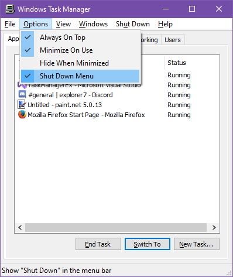
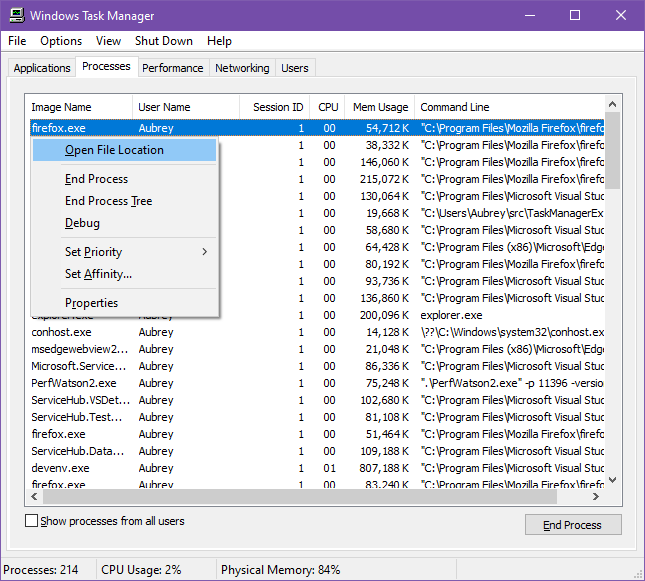
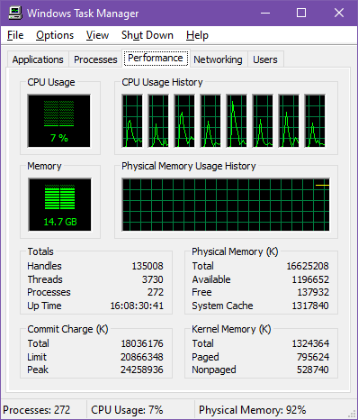

# TaskManagerEx
TaskManagerEx is a modified version of the Task Manager from Windows Server 2003 designed to improve the experience of using it while also
keeping it mostly the same visually.

## Previews

**Shut Down Menu option**

**Processes tab with new menu items**

**Performance tab with physical memory instead of PF usage as well as Up Time**

